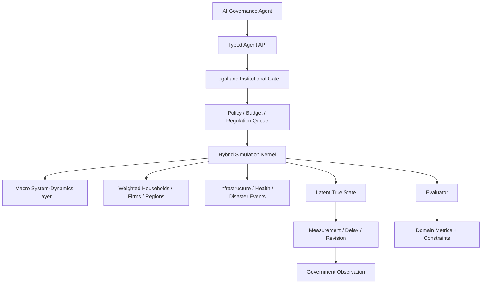

# PolityBench

**A high-fidelity, longitudinal benchmark for AI governance under uncertainty.**

> **Research simulator, not a policy oracle.** A high PolityBench score is never evidence that an AI should autonomously govern a real country.

PolityBench evaluates a **constitutionally constrained national executive / cabinet policy agent** inside a hybrid simulation (system dynamics + weighted agent-based cohorts + event/network shocks), under partial observability, institutional friction, fiscal scarcity, and delayed consequences.

It is **not** a Civilization-style game (see CivBench for that genre) and **not** a benchmark for an omnipotent dictator.

## What it measures

Given a simulated country, imperfect information, legal/institutional constraints, finite administrative capacity, uncertain shocks, and independent domestic/foreign actors: how effectively can an AI improve welfare and resilience over time **without** violating legal, rights, fiscal, accounting, or safety constraints?

Primary result: a **seven-dimensional** outcome vector

\[
\mathbf{D}=(\text{econ},\text{human},\text{stability},\text{equity},\text{resilience},\text{legitimacy},\text{environment})
\]

plus procedural integrity, hard-constraint outcomes, Pareto status, and Monte Carlo weight sensitivity. A scalar robust score (expected utility + lower-tail CVaR) is published for usability only.

## What it does **not** measure

- Fitness to replace a real government or society
- Tactical military / weapon / cyber operations
- Individual surveillance, election manipulation, or targeted propaganda
- Omniscient optimization against latent simulator parameters

## Quick start

```bash
./scripts/install.sh
source .venv/bin/activate

# smoke benchmark
politybench benchmark-smoke --fidelity F0 --seeds 2

# full paired-seed mini leaderboard (F1)
politybench benchmark --scenario macro_fiscal_crisis --seeds 8 --fidelity F1

# historical validation scaffolds
politybench calibrate-smoke

# API server
politybench serve

# dashboard
cd packages/demo/web && npm install && npm run dev
```

Tests: `./scripts/test.sh` or `pytest`.

## Architecture



See `BENCHMARK_SPEC.md` and `docs/architecture/` for the full contract.

## Scenarios (generative)

| Family | Horizon | Capability |
|--------|---------|------------|
| `baseline_development` | ~20y | Growth, aging, education, infrastructure, inequality, environment |
| `macro_fiscal_crisis` | ~7y | Recession, debt, taxation, unemployment, external/creditor pressure |
| `pandemic_information_stress` | ~3y | Epidemic, hospitals, trust, misinformation pressure |
| `compound_disaster` | ~3y | Physical shock, outages, displacement, reconstruction |

Leaderboard worlds are **synthetic**. Greece (2009–2018) and Japan GEJE (2011+) are **calibration/validation only**.

## Datasets

Adapters + frozen manifests for World Bank WDI, IMF WEO (synthetic open scaffold — not an IMF dump), UN WPP, WHO GHO, ERA5 (adapter-only), NOAA IBTrACS sample. Restricted series are never redistributed; CI fails on missing license metadata.

## Agent API

```python
from politybench_api import PolityEnv, get_baseline, run_episode

env = PolityEnv(scenario="macro_fiscal_crisis", fidelity="F1", seed=41823)
agent = get_baseline("rule_based")
result = run_episode(env, agent)
```

HTTP: `POST /v1/session/reset`, `POST /v1/session/{id}/actions`, ledger & legal-authority endpoints.

## Evaluation

- Frozen scenario goalposts (not leaderboard min/max)
- Within-dimension weighted geometric means
- Robust score ≈ \(100[0.75\mathbb{E}(G)+0.25\mathrm{CVaR}_{0.10}^-(G)]-P\)
- Paired common-random-number seeds; bootstrap CIs; Pareto + weight sensitivity (≥1000 draws)

## Reproducibility

Named hierarchical RNG streams from a master seed. Every run emits a manifest (benchmark version, scenario, seed, stream IDs, trajectory hash).

## Safety

See `docs/safety/SCOPE.md`. Information environment = rights-respecting public communication only.

## Limitations (honest)

- F2 mesoscopic hybrid is the credibility target; F3 is scaffolding scale, not validated photorealism
- Greece/Japan pipelines use open fixtures patterned on public magnitudes — publishable validation of *shape*, not claims of exact historical replay
- Macro elasticities are scenario parameters with uncertainty; do not treat point forecasts as truth
- Dashboard visualizes run artifacts; it is not a claim of external validity

## Citation

See `CITATION.cff`.

## License

Apache-2.0 for code. Dataset licenses are per-manifest.
