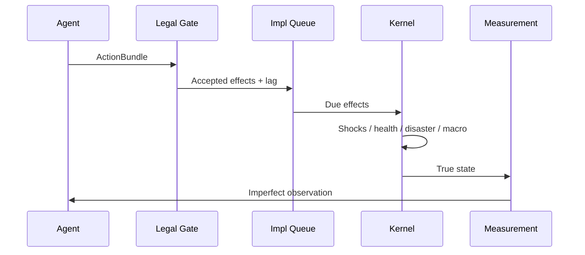

# Architecture notes

## Coupling contract

| Layer | Owns | Hands off |
|-------|------|-----------|
| Macro SD | GDP identity, prices, debt stock, productivity | Employment rate, fiscal flows |
| Households | Weighted distributional cohorts | Aggregate consumption propensity via weights |
| Institutions | Authority, delays, rejections | Approved policy effects to queue |
| Events/networks | Disasters, epidemics, capacity queues | Damage fractions, occupancy, displacement |
| Measurement | Observation noise/delay/revision | Never latent θ or future shocks |

## Timestep

## RNG

`seed_m = SHA256(master, scenario, module, entity)` → independent NumPy Generator per module.
